# Student Lifestyle, Academic Performance & Wellbeing Dashboard

## 1. Project Description / Overview

This project presents a Power BI dashboard that analyzes student lifestyle, academic performance, and wellbeing indicators. The dashboard focuses on how sleep duration, study hours, social media usage, physical activity, and stress level relate to CGPA and depression status.

The dashboard is designed to be simple, readable, and decision-oriented. It uses summary KPIs, interactive filters, and visual comparisons to help identify lifestyle patterns that may affect student academic performance and mental wellbeing.

### Main Objective

To develop an interactive Power BI dashboard that provides descriptive insights about student lifestyle patterns and their relationship with academic performance and wellbeing.

### Key Questions Answered

1. What is the overall academic and wellbeing profile of the students?
2. What percentage of students are marked as depressed?
3. How does stress level relate to depression rate?
4. How does sleep duration relate to stress level?
5. How does study time relate to CGPA?
6. How does social media usage relate to CGPA?
7. How do lifestyle indicators differ between depressed and not depressed students?

---

## 2. Data Collection Procedure


The dataset used in this project was provided as a CSV file named:

```text
student_lifestyle_100k.csv
```

The file was imported into Power BI Desktop for analysis and dashboard development. Since the project uses a provided dataset, the data collection procedure focused on acquiring, importing, validating, and preparing the dataset for modeling and visualization.

### Data Collection Steps


| Step | Description |
|---|---|
| 1 | Obtained the raw CSV dataset named `student_lifestyle_100k.csv`. |
| 2 | Imported the CSV file into Power BI Desktop. |
| 3 | Reviewed the column names, data types, and sample records. |
| 4 | Checked the dataset for missing values, duplicates, and inconsistencies. |
| 5 | Confirmed that the dataset was already clean and ready for modeling. |
| 6 | Proceeded to data modeling by creating dimension and fact tables. |

---

## 2.a. Raw Dataset Profile


The original dataset contains student-level information about demographics, lifestyle habits, academic performance, stress level, and depression status.

### Dataset Summary

| Item | Description |
|---|---:|
| File Name | `student_lifestyle_100k.csv` |
| Number of Records | 100,000 |
| Number of Columns | 11 |
| Granularity | One row per student |
| Missing Values | None detected |
| Duplicate Rows | None detected |
| Main Analytical Focus | Lifestyle, CGPA, stress, and depression |

### Original Dataset Fields

| Field Name | Description | Data Type / Example |
|---|---|---|
| Student_ID | Unique student identifier | Whole number |
| Age | Age of the student | Whole number |
| Gender | Gender of the student | Text |
| Department | Department or academic field | Text |
| CGPA | Academic performance measure | Decimal number |
| Sleep_Duration | Daily sleep duration in hours | Decimal number |
| Study_Hours | Daily study hours | Decimal number |
| Social_Media_Hours | Daily social media usage in hours | Decimal number |
| Physical_Activity | Daily physical activity in minutes | Whole number |
| Stress_Level | Student stress level | Whole number |
| Depression | Depression status | Boolean, TRUE/FALSE |

### Initial Dataset Statistics

| Metric | Value |
|---|---:|
| Total Students | 100,000 |
| Average CGPA | 2.90 |
| Average Sleep Duration | 7.00 hours |
| Average Study Hours | 4.51 hours |
| Average Social Media Usage | 3.50 hours |
| Average Physical Activity | 74.35 minutes |
| Average Stress Level | 4.13 |
| Depression Rate | 10.06% |

---

## 3. Data Cleaning Process / Documentation

After checking the dataset, it was found that the data was already clean. Therefore, major cleaning tasks such as missing value imputation, duplicate removal, and correction of inconsistent records were not required.

However, the cleaning and preparation process was still documented using the CLEAN framework as a guide. The main preparation work focused on validation, data transformation, and data modeling.

### CLEAN Framework Documentation


### Cleaning Decision

Because the dataset had no missing values, no duplicate rows, and no major inconsistencies, the cleaning phase was skipped after validation. The project proceeded directly to data transformation and data modeling.

---

## 4. Data Model: Snowflake Schema

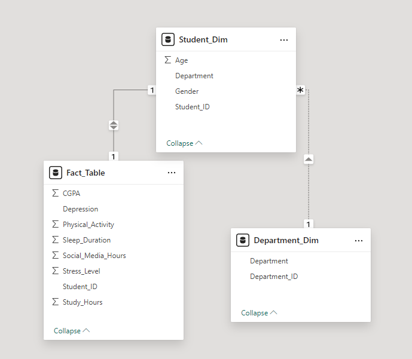

The data model uses a snowflake schema. This design separates descriptive student and department information into dimension tables, while measurable academic and lifestyle values are stored in the fact table.

### Reason for Using Snowflake Schema

A snowflake schema was used because the department information was separated from the student dimension into its own department dimension table. This reduces repeated department values and improves model organization.


## 5. Dashboard Wireframe Layout Following the DASH Framework

The dashboard design follows the DASH framework to make sure the report is purposeful, organized, and easy to understand.

### DASH Framework Application

| DASH Step | Application in This Dashboard |
|---|---|
| D - Define the purpose | The dashboard focuses on student lifestyle, academic performance, stress, and depression status. |
| A - Analyze the key metrics | The main metrics are Total Students, Average CGPA, Average Stress Level, Depression Rate, and Average Sleep Hours. |
| S - Sketch the layout | The layout uses a top KPI row, a left-side slicer, and six main visuals arranged in a clean grid. |
| H - Highlight insights | Important patterns are highlighted through charts about stress, depression, sleep, study time, and social media usage. |

### Wireframe Layout

```text
+--------------------------------------------------------------------------------+
| Student Lifestyle, Academic Performance & Wellbeing Dashboard                   |
+--------------------------------------------------------------------------------+
| Department Slicer | Total Students | Avg CGPA | Avg Stress | Depression | Sleep |
|                   |                |          |            | Rate       | Hours |
|-------------------+------------------------------------------------------------|
|                   | Depression Distribution     | CGPA by Social Media Usage  |
|                   |-----------------------------+------------------------------|
|                   | Stress by Sleep Duration    | CGPA by Study Group          |
|                   |-----------------------------+------------------------------|
|                   | Lifestyle Summary by        | Depression Risk by Stress    |
|                   | Depression Status           | Level                        |
+--------------------------------------------------------------------------------+
```

---

## 6. Visualization & Dashboard

The dashboard was developed in Power BI and includes KPIs, filters, interactivity, and readable charts.

### Dashboard Components

| Component | Visual Type | Purpose |
|---|---|---|
| Total Students | KPI Card | Shows total number of students |
| Average CGPA | KPI Card | Shows overall academic performance |
| Average Stress Level | KPI Card | Shows general stress condition |
| Depression Rate | KPI Card | Shows percentage of students marked as depressed |
| Average Sleep Hours | KPI Card | Shows average sleep duration |
| Department Filter | Slicer | Allows filtering by department |
| Depression Distribution | Donut Chart | Shows depressed vs not depressed students |
| CGPA by Social Media Usage | Clustered Column Chart | Shows how social media usage relates to CGPA |
| Stress Level by Sleep Duration | Clustered Column Chart | Shows how sleep duration relates to stress |
| CGPA by Study Group | Clustered Column Chart | Shows how study hours relate to CGPA |
| Depression Risk by Stress Level | Bar Chart | Shows depression rate by stress group |
| Lifestyle Summary by Depression Status | Matrix | Compares lifestyle metrics between depressed and not depressed students |


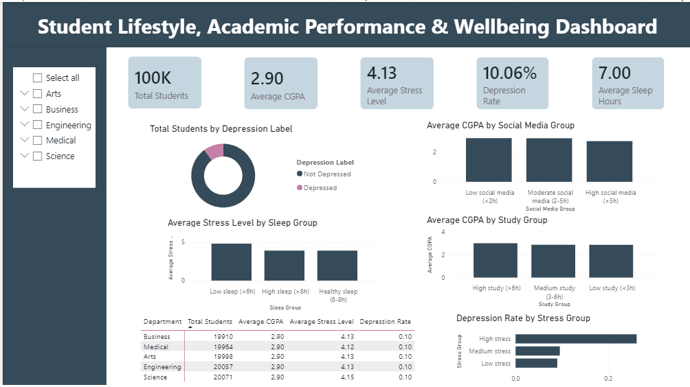


## Power BI Measures

The following DAX measures were created in Power BI.

### Total Students

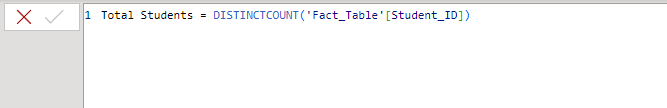

### Average CGPA

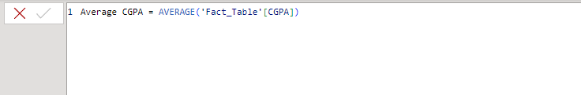

### Average Sleep Hours

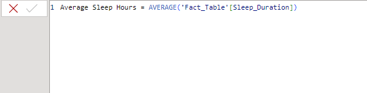

### Average Study Hours

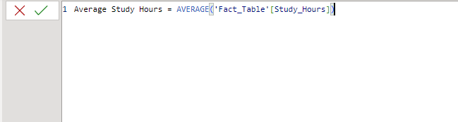

### Average Social Media Hours

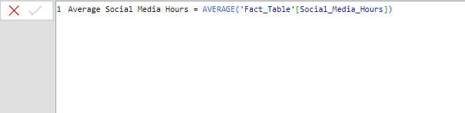

### Average Physical Activity

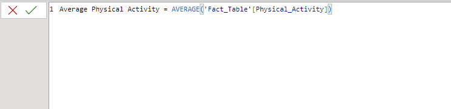

### Average Stress Level

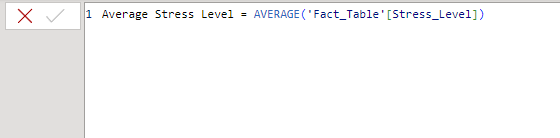

### Depressed Students

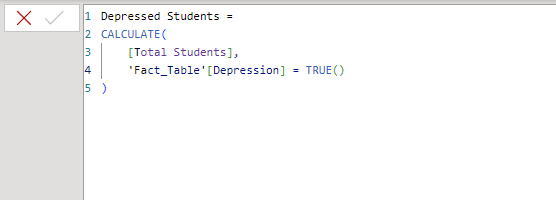

### Depression Rate

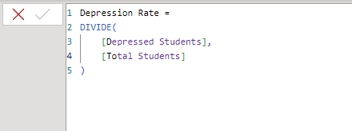

## Calculated Columns

The following calculated columns were created to make the dashboard easier to interpret.

### Depression Label

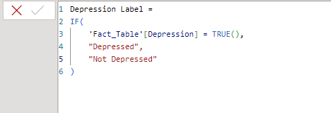

### Sleep Group

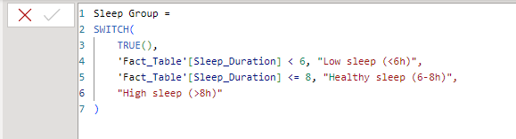

### Study Group

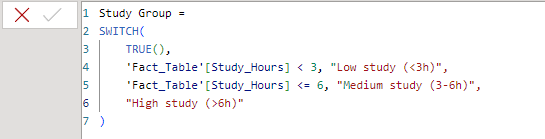

### Social Media Group

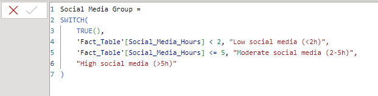

### Activity Group

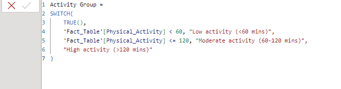

### Stress Group

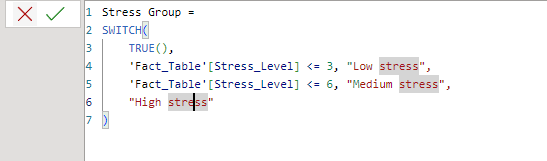

---

## 7. Insights and Recommendations

### Insight 1: High stress is strongly related to higher depression rate

Students in the high stress group have a much higher depression rate compared with students in the low and medium stress groups.

**Recommendation:** Schools should create stress monitoring programs, counseling support, and wellness activities targeted at high-stress students.

### Insight 2: Low sleep is linked with higher stress

Students with low sleep have a higher average stress level compared with students with healthy or high sleep duration.

**Recommendation:** Promote sleep awareness campaigns and encourage students to manage study schedules, screen time, and rest periods properly.

### Insight 3: Higher study hours are associated with better CGPA

Students in the high study group tend to have a higher average CGPA compared with students in the low and medium study groups.

**Recommendation:** Provide academic support programs, study planning workshops, and peer tutoring for students with low study hours.

### Insight 4: High social media usage is associated with lower CGPA

Students with high social media usage show lower average CGPA compared with students with low or moderate social media usage.

**Recommendation:** Encourage balanced digital habits and provide digital wellbeing sessions to help students manage social media time.

### Insight 5: Depression status is connected with academic and lifestyle differences

Depressed students have a lower average CGPA and higher average stress level compared with not depressed students.

**Recommendation:** Academic advisers and student support offices should consider wellbeing indicators when designing student intervention programs.

---
